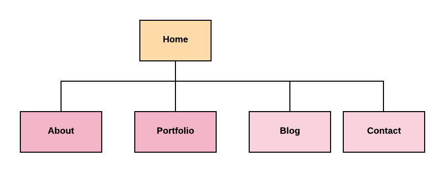

# My Personal Portfolio

### Purpose
The purpose of this assignment is to create a portfolio in the form of a website that can be used as a resource for potential employers during my job application process in the tech industry. This Portfolio provides a reference of my skills as a web developer, along with my work and study history. This portfolio will also convey my current skillsets in creating a responsive website by using the tech stack of HTML and CSS.

### Site map

### Tech stacks
* HTML 5
* CSS
* Figma
* GitHub
* Netlify

### Published Porftolio Website:
https://vibrant-shaw-e75d9c.netlify.com/